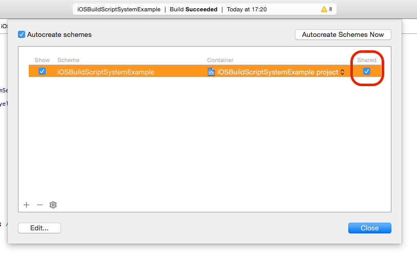
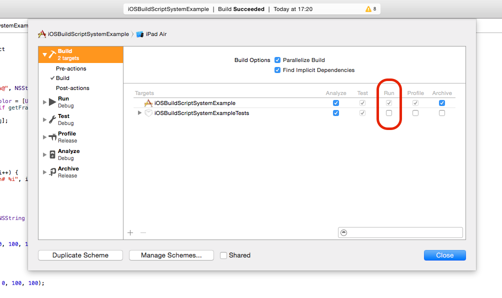

# iOSBuildScriptSystem
Rake based build system for iOS projects. 

The aim is to make the build process independent from a special tool like Jenkins. 
Jenkins should be used to glue build steps together, but not to define them. 

Especially build settings and variables should not be stored in a CI setup. With this it is errorprone or impossible to build the app the same way locally or on another CI system.

Therefore I wrote some ruby/rake scripts to get an independent reusable build system, which is easy to use with multiple schemes and build jobs per project.

The whole thing is very simple in its structure. All you have to to is to define a build settings file in the directory 'build_settings'. The build steps which are available can be found in the directory 'build_scripts'.

At the moment these steps are available:
- Set project parameters and check if there is any special definition in the Jenkins (CI) build job
- Clean build directory
- Build app
- Test app
- Sign app
- Distribute app

Furthermore there are steps for code metrics:
- Lines of code

* * *

## Getting started

1. Create a new build settings file in 'build_settings'.
2. Setup the 'workspace' and all the other build parameters in the new settings file.
3. Edit your used schemes. 
  - A scheme should be shared
  
    
    
  - Uncheck all unneccessary targets for Build > Run (i.e. tests because they will run separately)
  
    

#### Run the tasks
1. Navigate to the script directory of rakefile.rb
2. Type in `rake` to see your project specific build tasks.
3. Type in `rake -T` to see all tasks.
4. Type in `rake [build job name]:[build job task]`
5. Or combine multiple targets on command line like this: `rake job01:set_default_parameters build:build`

* * * 

## Known issues
- Distribution build step in progress
- Since xcodetool is used, it is not 100% possible to know the product name of the app-file. Therefore the first .app-file gets chosen for the signing process. That's why a selected scheme file should not build more than 1 .app-file!!!

